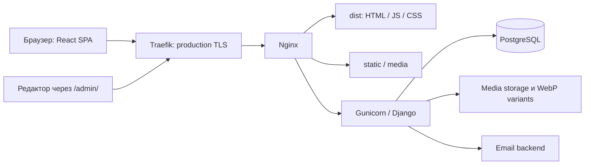

# AI DEF — инструкции и архитектура проекта

Этот файл применяется ко всему репозиторию. Архитектура описана по исходникам
на 7 октября 2026 года; при расхождении с текущим кодом сначала перечитай код.
`CLAUDE.md` использует этот файл как общий источник проектного контекста.

## Договор работы

- Отвечай по-русски, если пользователь не попросил другой язык.
- Сначала прочитай затрагиваемую реализацию и похожий существующий паттерн.
  Для поиска используй `rg` и `rg --files`.
- Перед ручными правками коротко сообщи, какие файлы и поведение меняешь.
  Правки делай через `apply_patch`, сохраняя чужие изменения в worktree.
- Решай поставленную задачу без соседнего рефакторинга, новых фич и замены стека.
  Не удаляй бизнес-логику как способ устранения ошибки.
- Не запускай тесты, сборку, линтер, typecheck, браузер или визуальные проверки
  и не создавай тестовые файлы без прямой просьбы пользователя. До такого
  запроса проверка ограничивается чтением кода, поиском и просмотром diff.
- Не создавай субагентов и не обращайся к другим агентам без личной просьбы
  пользователя. Не начинай автономный цикл аудита и полировки.
- Не применяй миграции к БД, не меняй рабочие данные, не публикуй образы и не
  выполняй развёртывание без запроса, который разрешает эти действия.
- Разрушительные команды и откат чужих изменений требуют явного разрешения.
  Если необходимое действие упёрлось в sandbox/network, используй штатный
  запрос approval; не обходи ограничение.
- Секреты, пользовательские заявки и токены не переноси в код, документацию
  или вывод команд. Значения из `.env.example` — примеры, не рабочие настройки.
- В финале укажи, что изменено, где, чем проверено и что не проверялось.

## Назначение и стек

AI DEF — многоязычная витрина продуктов и статей с формами обращений,
редакторской Django admin и отдельным клиентским порталом. Содержимое каталога
и блога хранится в БД; часть маркетинговых страниц задана непосредственно в JSX.

| Слой | Реализация в репозитории |
| --- | --- |
| Frontend | React 19, TypeScript 5.9, Vite 7, React Router 7 |
| UI | Tailwind CSS 4 через Vite plugin, Motion, Lucide/Tabler, Radix Dialog |
| Локализация UI | i18next + react-i18next, JSON namespace `common` |
| Backend | Python 3.11 в Docker/CI, Django 5.2.7 |
| API | Django function views + `JsonResponse`; DRF для авторизации |
| Редакторский интерфейс | Django admin, django-modeltranslation, TinyMCE |
| Хранение | PostgreSQL 16, файловые static/media volumes |
| Runtime | Gunicorn WSGI, Nginx; Traefik в production Compose |
| CI/CD | GitHub Actions, публикация двух Docker-образов в GHCR |

Версии и зависимости смотри в `frontend/package.json`,
`frontend/package-lock.json`, `backend/requirements.txt` и Dockerfiles.
Наличие `next` в зависимостях и директив `"use client"` не меняет архитектуру:
приложение запускается как Vite SPA, серверного Next.js runtime здесь нет.

В режиме разработки Vite обращается к отдельно запущенному Django по API URL.
Схема выше показывает production-путь; Nginx с собственным TLS используется
в другом Compose-варианте.

## Карта репозитория

| Путь | Ответственность |
| --- | --- |
| `backend/manage.py` | Django management entry point |
| `backend/aidef/settings.py` | Env, БД, middleware, языки, DRF, email, TinyMCE |
| `backend/aidef/urls.py` | Подключение admin, sitemap, TinyMCE и URL приложений |
| `backend/aidef/middleware.py` | Выбор языка контента через `?lang=` вне admin |
| `backend/aidef/sitemaps.py` | Локализованные статические и динамические URL |
| `backend/aidef/admin_mixins.py` | Общий переключатель языков admin и редактирование alt |
| `backend/main/` | Публичные продукты, гражданские продукты, блог, обращения |
| `backend/portal/` | Отдельный каталог портала, характеристики, модули |
| `backend/users/` | Пользователь по email, регистрация и token auth |
| `backend/templates/admin/` | Общие переопределения admin templates |
| `backend/main/templates/admin/` | Dashboard и форма переводов изображений |
| `backend/main/static/admin/` | CSS/JS редакторского интерфейса |
| `frontend/src/main.tsx` | i18n initialization, React root, BrowserRouter |
| `frontend/src/App.tsx` | Маршруты, LanguageLayout, lazy loading, analytics |
| `frontend/src/pages/` | Страницы и локальные типы/преобразования API |
| `frontend/src/i18n.ts` | Языки, загрузчики переводов, localized path helpers |
| `frontend/src/locales/{en,de,sk,es,fr,it}/common.json` | Переводы UI |
| `frontend/src/index.css` | Tailwind, Inter, цвета, контейнеры, CSS animations |
| `frontend/components/` | Header, Footer, Gallery, блоки home/product и UI |
| `frontend/hooks/` | Outside-click и однократное наблюдение видимости |
| `frontend/lib/` | `cn`, события контактной модалки и cookie consent |
| `frontend/src/analytics/ga4.ts` | GA4 с проверкой согласия |
| `frontend/public/` | Публичные картинки, видео, SVG, favicon, robots.txt |
| `frontend/src/assets/fonts/` | Шрифты, импортируемые из CSS |
| `Dockerfile`, `docker-compose*.yml` | Сборка и два варианта запуска стека |
| `frontend/nginx*.conf` | TLS напрямую либо HTTP за Traefik |
| `.github/workflows/` | Проверки и публикация образов |
| `deploy/logrotate.d/traefik` | Шаблон ротации логов production proxy |

`components`, `hooks` и `lib` находятся рядом с `src`, а не внутри него.
`frontend/tsconfig.app.json` включает все четыре каталога. Импорты в основном
относительные; не вводи новую структуру или алиасы в рамках локального фикса.

## Backend: доменные границы

### `main`: публичный контент

`models.py` содержит несколько самостоятельных семейств моделей:

- `Category` → `Product`. Продукт имеет slug, категорию, описание, `available`,
  `order`, `specs`, иконку и отдельное изображение для dropdown.
- Связанные с `Product` коллекции: `images`, `features`, `sub_features`,
  `gallery`, `technologies`, `feature_blocks`, `info_blocks`, `cta_blocks`.
  `drone_slider_media` и `final_cta_block` — OneToOne.
- `CivilCategory` → `CivilProduct` и соответствующие `CivilProduct*` блоки
  повторяют публичный каталог отдельными таблицами. У гражданского продукта
  есть `drone_slider_media`, но нет модели финального CTA, аналогичной
  `ProductFinalCTABlock`.
- `BlogCategory` и `BlogAuthor` → `BlogPost`. Статья имеет `is_published`, дату,
  время чтения, одиночный `hero_image`, коллекцию `hero_images`, `blocks` и
  прежние `sections`.
- `ContactRequest` хранит обращение, источник/язык, IP/User-Agent, вариант
  формы, статус, ответственного пользователя и внутреннюю заметку.

Каталоги возвращают только `available=True`, блог — только
`is_published=True`, в том числе на detail endpoint. Slug генерируется при
сохранении, если пустой, и используется в URL независимо от языка контента.
Порядок задаётся полями `order` и конкретными `order_by` в API; порядок модели
и endpoint может отличаться. Не заменяй его случайным порядком queryset.

`OptionalOverviewIconMixin` задаёт необязательные иконки feature/sub-feature.
В сериализации загруженный файл имеет приоритет над Lucide name, иначе `null`.
`validate_svg_file` по факту допускает и перечисленные растровые расширения;
проверка SVG ограничена поиском `<svg` в начале файла.

### `portal`: клиентский каталог

`PortalProduct` — самостоятельная модель, а не расширение `main.Product`.
Она использует общую `main.Category`, содержит serial number, tags и order.
Прямой связи продукта с владельцем-пользователем в текущей модели нет.

- Изображения имеют `is_preview`; API выбирает первое отмеченное preview,
  затем первое по `order`/ID. Gallery и presentation info хранятся отдельно.
- `ProductCharacteristic` принадлежит продукту и может ссылаться на
  `ProductCharacteristicsBlock`. API возвращает `characteristics.blocks`
  с вложенными items и `characteristics.items` для непривязанных записей.
- `ProductModule` переиспользуется несколькими продуктами через M2M
  `ProductModulePlacement`. Именно placement хранит product, block и order.
  Его `clean()` запрещает блок чужого продукта; `save()` вызывает `full_clean()`.
- У модуля есть собственные изображения и характеристики.
  API возвращает `modules.blocks` и отдельно непривязанные `modules.items`.
- `ProductTextBlock` и `ProductPresentationInfo` добавляют текстовые секции.

Одинаковые имена `ProductImage`, `ProductGallery` и других моделей в `main`
и `portal` относятся к разным таблицам. Всегда проверяй модуль импорта.

### `users`: авторизация

`User` основан на `AbstractBaseUser`/`PermissionsMixin`, идентификатор входа —
уникальный email (`AUTH_USER_MODEL='users.User'`). Создание выполняется через
`UserManager` с хешированием пароля. `RegisterSerializer` валидирует пароль,
проверяет email без учёта регистра, умеет разбирать `name`; входной `team`
отбрасывается и не хранится в User.

Register/login возвращают `{token, user}`. Используется DRF authtoken,
заголовок `Authorization: Token <token>`. Logout удаляет токен пользователя;
`me` возвращает профиль. Django admin использует собственную session auth.

## API и контракты

Корневой URLconf включает `main` и `portal` без дополнительного префикса:
полные `/api/...` пути объявлены внутри приложений. `users` подключён под
`/api/auth/`. API пути заканчиваются `/`; SPA пути обычно без завершающего `/`.

| Метод и путь | Обработчик / ответ |
| --- | --- |
| `GET /api/items/` | `main.api.item_list_api`: массив публичных продуктов |
| `GET /api/items/<slug>/` | `main.api.item_detail_api`: продукт с блоками |
| `GET /api/civil-items/` | `main.api.civil_item_list_api`: массив гражданских продуктов |
| `GET /api/civil-items/<slug>/` | `main.api.civil_item_detail_api`: гражданский продукт с блоками |
| `GET /api/blog/posts/` | `main.api.blog_post_list_api`: массив опубликованных статей |
| `GET /api/blog/posts/<slug>/` | `main.api.blog_post_detail_api`: статья с blocks/sections |
| `POST /api/contact/` | `main.api.contact_request_api`: `{status: 'ok', id}`, HTTP 201 |
| `GET /api/portal/products/` | `portal.api.portal_product_list_api`: массив продуктов портала |
| `GET /api/portal/products/<slug>/` | `portal.api.portal_product_detail_api`: продукт с группами и модулями |
| `POST /api/auth/register/` | `users.views.register`: token + user, HTTP 201 |
| `POST /api/auth/login/` | `users.views.login_view`: token + user |
| `POST /api/auth/logout/` | `users.views.logout_view`: требует token, HTTP 204 |
| `GET /api/auth/me/` | `users.views.me`: требует token, профиль |
| `GET /sitemap.xml` | Django sitemap для всех поддерживаемых языков |

Публичные и portal API — обычные Django views с ручными `_serialize_*`
функциями. Настройки DRF не добавляют им автоматически authentication или
permissions. Списки возвращают массив, без DRF pagination envelope.
Detail views поднимают `Http404`; не рассчитывай на единый JSON-формат ошибок
для всех Django и DRF endpoints.

У публичного list item есть `icon`, `dropdown_image`, `first_image` и
`drone_slider`. Dropdown/first image могут содержать `menu_url` для миниатюры.
Detail добавляет изображения и блоки, а у `Product` — `final_cta_block`.
Наличие `specs` в модели и TS type не означает его выдачу текущим API:
публичные сериализаторы его не включают.

Portal API переименовывает `serial_number` в `serial`, description в `summary`,
первый tag — в `highlight`; `images` в базовом ответе — массив URL-строк.
Не подменяй его типами изображений публичного каталога.

При добавлении API-поля проследи цепочку: модель → translation/admin при
необходимости → ручной serializer/queryset → TS type → mapping/render.
Добавляй `select_related`/`prefetch_related` для новых читаемых связей по
существующему паттерну. Отсутствующие media/блоки могут быть `null` или `[]`.

## Сквозные потоки

### Языки и URL

Поддерживаются `en`, `de`, `sk`, `es`, `fr`, `it`, fallback — английский.
Английские страницы имеют URL без `/en`; остальные — `/<lng>/...`.
`LanguageLayout` перенаправляет `/en/...` на путь без префикса, сохраняет
query/hash, синхронизирует i18n и `document.documentElement.lang`.

Используй `resolveLanguage`, `buildLocalizedPath`, `replaceLanguageInPath`,
`stripSupportedLanguageFromPath` из `src/i18n.ts`. UI-ресурсы загружаются
динамически через `ensureLanguageResources`; первоначальная загрузка
завершается до React render в `main.tsx`.

На backend `LocaleMiddleware` выбирает язык, затем `QueryLanguageMiddleware`
может переопределить его через `?lang=`. `/admin` и `/admin/...` исключены:
там параметр выбирает редактируемый перевод, а не язык интерфейса admin.
django-modeltranslation добавляет поля с суффиксами языков; регистрации
описаны в `main/translation.py`, `portal/translation.py` и импортируются в
`AppConfig.ready()`. `modeltranslation` расположен перед admin в INSTALLED_APPS.

У основных product images alt хранится в отдельных `*ImageTranslation`
таблицах с уникальностью `(image, lang)`; при создании image создаются
переводные записи. Gallery alt переводится через modeltranslation.
В публичном API `_get_request_language` сначала читает `Accept-Language`,
затем `request.LANGUAGE_CODE`, потом `en`; этот язык используется для image
alt и fallback языка обращения. Текстовые modeltranslation поля используют
активный Django язык. Учитывай разницу при смешивании header и query.

Новый язык затрагивает frontend loaders/JSON/Header, backend settings,
image translation choices, migrations и sitemap. Не добавляй его только
в один dropdown. Не предполагаи полную локализацию всех страниц: например,
`Solutions.tsx` содержит английские строки непосредственно в JSX.

### Заявка и email

`ContactForm` поддерживает `default` и `support`. Header лениво монтирует
общую модальную форму; страницы открывают её событием `open-contact-modal`
через `dispatchOpenContactModal`. Support использует тот же компонент.
Для стран используются Rest Countries, Intl и встроенные fallback данные.

Форма отправляет JSON с camelCase полями и добавляет `variant`, `language`,
`source`. Backend принимает JSON или form POST, валидирует email и обязательные
поля. Всегда нужны `firstName`, `lastName`, `email`, `message`; для `default`
также `phone`, `product`, `country`. Endpoint имеет `csrf_exempt` и `require_POST`.

Создание ContactRequest и синхронная отправка multipart text/HTML email
выполняются внутри `transaction.atomic()`. Ошибка отправки даёт HTTP 502 и
откатывает запись. При отсутствии валидных recipients запись сохраняется
без отправки email. Ошибка в ответе раскрывает причину только при DEBUG.
Значение product `strategic-partnership` маршрутизирует письмо в
`STRATEGIC_PARTNERSHIP_EMAIL`, с fallback в `CONTACT_REQUEST_NOTIFICATION_EMAILS`.
Это часть существующего контракта; не меняй транзакционную семантику попутно.

### Блог и совместимость контента

`BlogPostBlock` имеет виды `text`, `bullets`, `quote`, `image`, `divider`.
Содержимое включает `html`, старые `paragraphs/items`, image, anchor и order.
В admin HTML редактируется TinyMCE; прежние массивы скрыты в форме blocks.
Backend при наличии blocks использует их, иначе преобразует `BlogPostSection`
в blocks; ответ также сохраняет `sections` для совместимости.

`BlogPost.tsx` преобразует API в ArticleBlock, поддерживает старые sections,
оглавление/якоря и hero media. Страница имеет fallback-контент на ошибку или
неполный ответ; видимая статья сама по себе не подтверждает успешный API-запрос.
HTML выводится через `dangerouslySetInnerHTML`; `decorateRichTextHtml` добавляет
иконку к blockquote и не является санитайзером. Не расширяй источники этого
HTML до непроверенного пользовательского ввода без отдельной задачи.

### Media

Большинство media URL собирается через `request.build_absolute_uri`.
Заголовки Host и X-Forwarded-Proto влияют на их схему/домен и sitemap.
Portal block icon из model property может содержать относительный storage URL.

`main/image_variants.py` лениво создаёт WebP-миниатюры меню при чтении API:
профиль `menu`, bounding box 512×320, quality 76, сохранение пропорций,
EXIF transpose, `_variants` рядом с оригиналом. Файл переиспользуется по
mtime при файловом storage; при проблеме чтения/конвертации возвращается
оригинальный URL. GET списка поэтому может писать в media storage.

## Frontend: организация и поведение

`App.tsx` объявляет одинаковые PageRoutes под `/` и `/:lng`:
home, solutions, products/:slug, civil-products/:slug, technology, blog,
blog/:post, about-us, terms-of-condition, support, auth, client-portal и 404.
Header общий, Footer лениво появляется при приближении к нижнему sentinel.
Home и ProductDetail импортируются напрямую; остальные страницы — через lazy.

`Home.tsx` сразу показывает Hero, затем загружает DroneCarousel, FocusAreas,
SystemIntegration, BlogPosts и CustomerBenefits по видимости. Header загружает
каталоги dropdown по необходимости и запоминает загруженный язык.
ProductDetail/CivilProductDetail используют общий `OverviewSection`,
галереи и блоки из API. DroneCarousel объединяет два каталога, сохраняет
группировку public/civil, порядок и media fallback.

Загрузка данных распределена по страницам/компонентам: используются `axios`
и `fetch`, локальный state, `useEffect`, `AbortController`, локальные TS types
и mapping functions. Общего API client или state store сейчас нет.
При локальном изменении повторяй паттерн файла и отменяй устаревший запрос
при смене языка/slug и unmount; не вводи новый data layer без запроса.

Есть два способа вычислять API base:

- ProductDetail, CivilProductDetail и DroneCarousel напрямую используют
  `VITE_API_URL`, который должен уже включать `/api`.
- Header, Auth, ClientPortal, contact и blog нормализуют
  `VITE_API_BASE_URL || VITE_API_URL`, убирают конечный `/`, добавляют `/api`
  при необходимости, с fallback `/api`.

В отслеживаемых frontend env: development `.env.local` задаёт
`http://127.0.0.1:8000/api`, `.env.production` — `/api`.
`vite.config.ts` не настраивает proxy. Vite env встраивается при сборке:
изменение env только у runtime Nginx не меняет готовый JS.

`Auth.tsx` реально подключает signin к `/auth/login/`, сохраняет `authToken`
и `authUser` в localStorage при remember или sessionStorage иначе, отправляет
событие `auth-updated` и переходит в portal. Header слушает это событие;
logout очищает оба storage. Signup UI сейчас только валидирует страну и
показывает success, не вызывает `/auth/register/` и не создаёт пользователя.

`ClientPortal.tsx` проверяет наличие token в storage и перенаправляет на auth,
но загрузка portal products не отправляет Authorization. Backend portal GET
views также не проверяют token. Не описывай текущий portal API как защищённый
и не считай frontend redirect серверной проверкой доступа.

Стили опираются на `src/index.css`: Tailwind 4 `@theme inline`, Inter,
цветовые переменные, `.container`/`.container-big`, responsive classes.
`cn` в `lib/utils.ts` объединяет clsx и tailwind-merge. ScrollReveal использует
`useInViewOnce`/IntersectionObserver и CSS transitions; Motion применяется
в отдельных UI-компонентах. Сохраняй текущие skeletons, размеры media,
lazy loading, cleanup эффектов и доступность элементов при UI-правках.

`vite.config.ts` включает React Compiler и `inlineEntryCss`: build plugin
встраивает entry stylesheet в `index.html`. Это влияет на доставку CSS;
не удаляй plugin как шаблонный код. `frontend/README.md` — исходный Vite
template, для реальной архитектуры используй исходники и этот документ.

### Аналитика

GA4 включается только в production build, с непустым
`VITE_GA4_MEASUREMENT_ID` и согласиями `accepted`. Consent хранится под
`aidef-cookie-consent`, изменение передаётся событием
`aidef-cookie-consent-change`. Скрипт загружается отложенно, page_view
отправляется при навигации и принятии согласия. Cookie banner монтируется
после загрузки/первого взаимодействия или задержки. Сохраняй consent gate.

## Django admin

Admin — основной интерфейс управления контентом, отдельной редакторской SPA
нет. Модели, forms, inlines, actions и fieldsets находятся в `main/admin.py`,
`portal/admin.py`, `users/admin.py`.

- Общие language controls реализованы в `aidef/admin_mixins.py`,
  `backend/templates/admin/submit_line.html`, `base_site.html` и static JS/CSS.
- `HiddenModelTranslationTabsAdmin` скрывает стандартные translation tabs.
  `SingleLanguageTranslatedInlineMixin` в main ограничивает соответствующие
  inlines выбранным языком; не предполагаи, что все portal inlines используют
  точно такой же механизм.
- Изображения создаются в product inline; отдельная image change form
  редактирует alt выбранного языка и показывает покрытие переводов.
- Формы допускают удобный ввод JSON/строк для specs, tags и списков.
  Сохраняй серверную валидацию и преобразование при изменении полей.
- Portal admin управляет общими модулями и placements, ограничивает выбор
  module block текущим продуктом; preview action оставляет один preview
  на продукт. Единственность preview обеспечивается action, не DB constraint.
- ContactRequest admin содержит workflow статусов, назначение ответственного
  и внутренние заметки; dashboard — `main/templates/admin/custom_index.html`.

При изменении редакторского поля просматривай model, translation, form,
inline, shared templates и API consumer вместе. Изменения translation fields
могут требовать миграции дополнительных колонок; старые миграции не переписывай.

## Конфигурация, запуск и deployment

`settings.py` читает env через python-dotenv. Основные группы:

| Группа | Переменные / особенности |
| --- | --- |
| Django | `DJANGO_SECRET`, `DJANGO_DEBUG`, `DJANGO_ALLOWED_HOSTS`, `DJANGO_TIME_ZONE` |
| Origins | `DJANGO_CORS_ALLOWED_ORIGINS`, `DJANGO_CSRF_TRUSTED_ORIGINS` |
| PostgreSQL | `POSTGRES_HOST`, `POSTGRES_PORT`, `POSTGRES_USER`, `POSTGRES_PASSWORD`, `POSTGRES_DB_NAME` |
| Legacy fallback | `DEBUG`, `ALLOWED_HOST`, `DB_HOST`, `DB_PORT`, `DB_USER`, `DB_PASS`, `DB_NAME`; также `POSTGRES_DB` |
| Mail | `EMAIL_BACKEND`, `EMAIL_HOST`, `EMAIL_PORT`, `EMAIL_HOST_USER`, `EMAIL_HOST_PASSWORD`, TLS/SSL, `DEFAULT_FROM_EMAIL` |
| Routing заявок | `CONTACT_REQUEST_NOTIFICATION_EMAILS`, `STRATEGIC_PARTNERSHIP_EMAIL` |
| Compose | `DOCKER_POSTGRES_HOST` переопределяет host backend, по умолчанию `db` |
| Production | `DOMAIN`, `DOMAIN_WWW`, `ACME_EMAIL`, `DATA_DIR`, optional `BACKEND_IMAGE`/`FRONTEND_IMAGE` |

БД только PostgreSQL; `ATOMIC_REQUESTS=True`. `LANGUAGE_CODE='en'` задан кодом,
timezone по умолчанию `Europe/Kyiv`. DEBUG без env по умолчанию включён.
В `.env.example` указан `MAIL_BACKEND`, но settings читает `EMAIL_BACKEND`:
без него применяется console backend. Placeholder `DJANGO_TIME_ZONE=Region/City`
нужно заменить перед запуском. Не копируй примеры как готовый production env.

### Два Compose-варианта

`docker-compose.yml` запускает db/backend/web, Nginx самостоятельно завершает
TLS и ожидает существующие сертификаты в `/etc/letsencrypt/live/ai-def.com/`.
Web публикует 80/443; backend и db host ports не публикуют. Используются
`postgres_data`, `static_volume`, bind `backend/media` и каталоги сертификатов.
Поэтому указание README о доступном `localhost:8000/admin/` после Compose
не соответствует текущим ports. Этот вариант не является готовым Vite dev stack.

`docker-compose.prod.yml` добавляет Traefik, который владеет 80/443,
получает TLS через ACME HTTP-01 и проксирует HTTP к web. Nginx собирается с
`NGINX_CONF=frontend/nginx.proxied.conf`. Persistent data:
`DATA_DIR/postgres`, `DATA_DIR/media`, `DATA_DIR/traefik/letsencrypt`,
`DATA_DIR/traefik/logs`. Static volume пересоздаваемый через collectstatic.

Backend Dockerfile при каждом старте выполняет migrate, collectstatic,
затем Gunicorn с тремя workers на 8000. Healthcheck проверяет TCP socket,
не содержимое API. Основной frontend image собирается корневым Dockerfile
из контекста репозитория; `frontend/Dockerfile` — отдельный вариант и не
используется текущими Compose/CI publish jobs.

Nginx раздаёт SPA с `try_files ... /index.html`, proxy `/api/`, `/admin/`,
`/sitemap.xml`, alias `/media/`, `/static/`. HTML не кешируется, hashed assets
кешируются как immutable на год, часть media/static — на 30 дней.
`nginx.proxied.conf` сохраняет внешний X-Forwarded-Proto, settings доверяет ему.
Меняя proxy, учитывай абсолютные URL, CSRF, sitemap и redirect.

Домены `ai-def.com`/`www.ai-def.com` также зашиты в Nginx и robots.txt;
новое значение `DOMAIN` в Traefik само по себе не меняет canonical redirects
и sitemap reference. URL `/tinymce/` подключён в Django, но отдельного proxy
location в обоих Nginx нет. При задаче по editor/deployment проследи этот путь.
`deploy/logrotate.d/traefik` содержит пример `/data/web/...`, требующий
согласования с выбранным DATA_DIR.

### Команды для запрошенного запуска и проверки

Это справочник, а не разрешение автоматически запускать команды.
Потребуются установленные зависимости, валидный env и доступная PostgreSQL.

| Рабочий каталог | Команда | Назначение |
| --- | --- | --- |
| `frontend/` | `npm ci` | Установка по package-lock |
| `frontend/` | `npm run dev` | Vite development server |
| `backend/` | `python -m pip install -r requirements.txt` | Установка backend зависимостей в выбранное окружение |
| `backend/` | `python manage.py runserver 127.0.0.1:8000` | Django development server |
| `frontend/` | `npm run lint` | ESLint |
| `frontend/` | `npm run build` | `tsc -b` и Vite production build |
| `frontend/` | `npm run preview` | Preview собранного frontend |
| `backend/` | `python manage.py check` | Django system checks |
| `backend/` | `python manage.py makemigrations --check --dry-run` | Проверка model/migration drift |
| `backend/` | `python manage.py test` | Django suite с отдельной test DB |
| корень | `docker compose -f docker-compose.prod.yml up -d` | Запуск production stack с миграциями и внешним ACME |

Последняя команда меняет состояние стека и запускает миграции, поэтому
используется только в рамках явно запрошенного deployment. Наличие Docker,
PostgreSQL, зависимостей или готового `.env` не предполагается без проверки.

## CI и имеющаяся проверка

`.github/workflows/ci.yml` запускается на PR, push в `master` и вручную:
Node 20 — `npm ci`, lint, build; Python 3.11/PostgreSQL 16 — зависимости,
Django check, migration drift, tests. Lint и Django tests сейчас имеют
`continue-on-error: true`; build, check и migration drift — нет.
Комментарии workflow описывают прежние ошибки; это не свежий результат тестов.
Зелёный статус workflow не доказывает прохождение необязательных шагов.

`main/tests.py` содержит проверки admin, публичных API, blog compatibility,
menu images и email/rollback; `portal/tests.py` — admin smoke tests,
переводы alt и preview actions. `users/tests.py` — placeholder.
В package.json нет команды frontend test и отдельного test runner.

`.github/workflows/docker-publish.yml` отдельно публикует backend/frontend
в GHCR на `master`, теги `v*` и ручной dispatch. Теги: latest, sha, semver;
frontend использует proxied Nginx. Workflow публикации не зависит от job CI,
поэтому публикация сама по себе не свидетельствует о прохождении проверок.

## Где начинать конкретную задачу

| Задача | Цепочка файлов |
| --- | --- |
| Поле/блок публичного продукта | `main/models.py` → `translation.py`/`admin.py` → `api.py` → ProductDetail/CivilProductDetail → OverviewSection |
| Карточки dropdown/карусели | `main/api.py` + `image_variants.py` → Header → DroneCarousel/apple-cards-carousel |
| Характеристики/модули портала | `portal/models.py` → admin/translation/api → ClientPortal |
| Signin/logout/доступ | users models/serializers/views → Auth → Header → ClientPortal; отдельно проверяй permissions portal API |
| Заявки/письма | contact-form → `main/api.py` → ContactRequest/admin → settings/env |
| Статья/редактор | BlogPostBlock/admin/TinyMCE → blog API → Blog/BlogPost/home BlogPosts |
| Язык/маршрут | i18n/JSON/Header/App → middleware/settings/translation → sitemaps |
| Consent/analytics | cookie-consent lib/UI → App → ga4.ts |
| Deployment/API base | env → Dockerfiles/Compose → Nginx → settings → frontend API consumers |

При архитектурном изменении обнови соответствующий раздел этого файла и
краткий индекс `CLAUDE.md`, сохраняя единый источник подробного описания.
