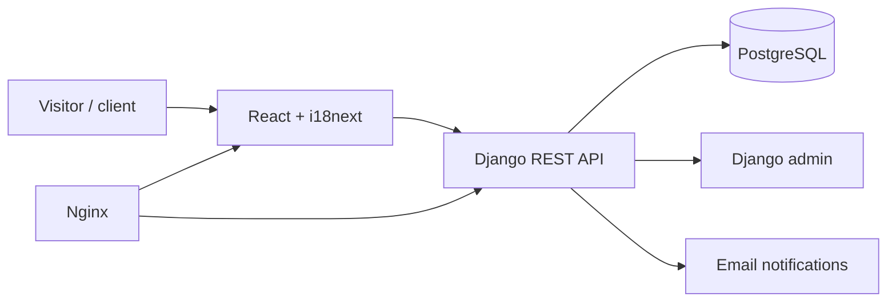

# AI DEF

**A multilingual product and client platform that helps a defense-adjacent technology company present lawful solutions, manage editorial content, and turn international interest into structured enquiries.**

[Live Website](https://www.ai-def.com) · [Source](https://github.com/eerinessofsilence/aidef) · [Local Admin](http://localhost:8000/admin/)


> **Status:** deployed portfolio project. Public content and enquiry flows are implemented; integrations and operational controls should be reviewed before production reuse.

## What it delivers

- Organizes products, solutions, technology, articles, support, and legal content into one editorial system.
- Serves localized content in English, German, Slovak, Spanish, French, and Italian.
- Lets staff manage products, media, and requests through Django admin.
- Routes contact and strategic-partnership enquiries with configurable email notifications.
- Protects client-portal endpoints with token authentication.
- Packages React, Django, PostgreSQL, Nginx, and Gunicorn for repeatable deployment.
- Builds, tests, and publishes images via GitHub Actions and GitHub Container Registry.

## Architecture



In production, [Traefik](https://traefik.io) sits in front of Nginx to terminate
TLS and manage Let's Encrypt certificates automatically — see
[Deployment](#deployment).

## Quick start

```bash
git clone https://github.com/eerinessofsilence/aidef.git
cd aidef
cp .env.example .env
docker compose up --build
```

After migrations complete, open the frontend on the port defined by the Compose stack and the admin at `http://localhost:8000/admin/`.

## Tests, security, and limits

```bash
cd frontend && npm run lint && npm run build
cd ../backend && python manage.py test
```

These same checks run in CI on every pull request — see
[Continuous Integration](#continuous-integration).

- Keep Django, database, mail, and token secrets outside Git and rotate production credentials.
- The platform is intended for lawful commercial, educational, and portfolio use; it contains no weapon-building instructions.
- Authentication, authorization, uploaded media, email delivery, backups, and audit logging need deployment-specific review.
- No independent security assessment is included.

## Continuous Integration

Two workflows in `.github/workflows`:

- **`ci.yml`** — on every pull request and push to `master`. Lints and builds the
  frontend (`npm run build` runs `tsc -b`, so this type-checks too), then runs
  Django system checks, a migration-drift check, and the test suite against a
  throwaway PostgreSQL service container.
- **`docker-publish.yml`** — on pushes to `master`, on `v*` tags, or on manual
  dispatch. Builds the backend and frontend images and pushes them to GitHub
  Container Registry, tagged `latest`, `sha-<commit>`, and semver on tags.

## Deployment

`docker-compose.prod.yml` runs the stack behind Traefik, which terminates TLS
and obtains and renews Let's Encrypt certificates automatically — there is no
`certs/` directory to populate or rotate by hand. Nginx sits behind it serving
the SPA and static/media files, and proxying `/api` and `/admin` to Gunicorn.

**Before the first start**, point DNS `A` records for both `DOMAIN` and
`DOMAIN_WWW` at the server and leave port 80 open — Traefik needs it for the
Let's Encrypt HTTP-01 challenge, even though all traffic is redirected to HTTPS.

```bash
cp .env.example .env   # then fill in secrets, DOMAIN, ACME_EMAIL, DATA_DIR
docker compose -f docker-compose.prod.yml up -d
```

Create the first admin user once the stack is healthy:

```bash
docker compose -f docker-compose.prod.yml exec backend python manage.py createsuperuser
```

Migrations and `collectstatic` run automatically on every backend start.

### Deploying prebuilt images

To skip building on the server, set `BACKEND_IMAGE` and `FRONTEND_IMAGE` in
`.env` to the GHCR tags published by `docker-publish.yml`, then:

```bash
docker compose -f docker-compose.prod.yml pull
docker compose -f docker-compose.prod.yml up -d
```

Pin to a `sha-<commit>` tag rather than `latest` so a bad release can be rolled
back by editing one variable.

### Persistent data and logs

Everything that must survive a rebuild lives under `DATA_DIR`:

| Path | Contents |
| --- | --- |
| `$DATA_DIR/postgres` | Database |
| `$DATA_DIR/media` | Uploaded media |
| `$DATA_DIR/traefik/letsencrypt` | Issued certificates (`acme.json`) |
| `$DATA_DIR/traefik/logs` | Traefik access and error logs |

Point `DATA_DIR` at a dedicated, snapshotted disk in production and back that
single directory up. To keep Traefik's logs from filling it, install the
provided rotation config (adjusting the path inside it to match `DATA_DIR`):

```bash
sudo cp deploy/logrotate.d/traefik /etc/logrotate.d/traefik
```

## License

Private portfolio project. All rights reserved.
