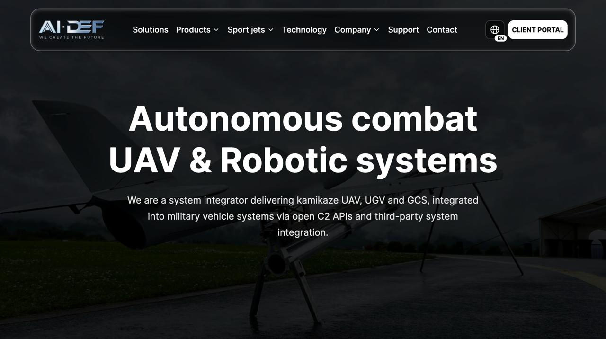
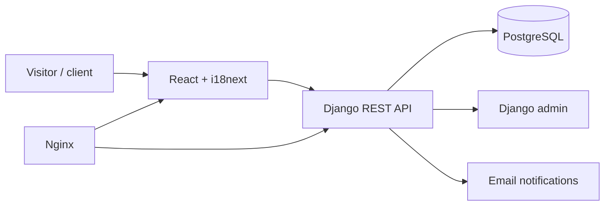

# AI DEF

**A multilingual product and client platform that helps a defense-adjacent technology company present lawful solutions, manage editorial content, and turn international interest into structured enquiries.**

[Live Website](https://www.ai-def.com) · [Source](https://github.com/eerinessofsilence/aidef) · [Local Admin](http://localhost:8000/admin/)



> **Status:** deployed portfolio project. Public content and enquiry flows are implemented; integrations and operational controls should be reviewed before production reuse.

## What it delivers

- Organizes products, solutions, technology, articles, support, and legal content into one editorial system.
- Serves localized content in English, German, Slovak, Spanish, and French.
- Lets staff manage products, media, and requests through Django admin.
- Routes contact and strategic-partnership enquiries with configurable email notifications.
- Protects client-portal endpoints with token authentication.
- Packages React, Django, PostgreSQL, Nginx, and Gunicorn for repeatable deployment.

## Architecture



## Quick start

```bash
git clone https://github.com/eerinessofsilence/aidef.git
cd aidef
cp .env.example .env
docker compose up --build
```

After migrations complete, open the frontend on the port defined by the Compose stack and the admin at `http://localhost:8000/admin/`.

## Tests, security, and limits

```bash
cd frontend && npm run lint && npm run build
cd ../backend && python manage.py test
```

- Keep Django, database, mail, and token secrets outside Git and rotate production credentials.
- The platform is intended for lawful commercial, educational, and portfolio use; it contains no weapon-building instructions.
- Authentication, authorization, uploaded media, email delivery, backups, and audit logging need deployment-specific review.
- No independent security assessment is included.

## License

Private portfolio project. All rights reserved.
